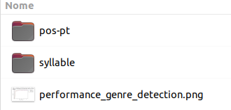
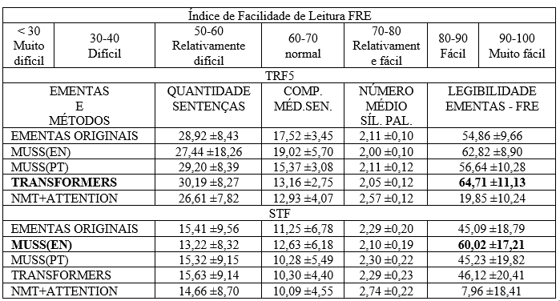

# Simplificação automática de textos jurídicos em português usando aprendizagem de máquina

Repositório de código da Dissertação apresentada ao programa de Mestrado em Engenharia de Software do Centro de Estudos e Sistemas Avançados do Recife – CESAR School, como requisito para a obtenção do título de Mestre em Engenharia de Software.

## Autor

* **Alexandre Marcolino Alves** ([ama2@cesar.school](mailto:ama2@cesar.school)).
* [Dissertação/Artigo](http://link-dissertacao-artigo).

## Problema

O problema ocorre no judiciário brasileiro, através da produção de textos necessários aos processos, os quais usam vocabulários complexos e jargões técnicos do meio jurídico que dificulta a leitura e o entendimento desse conteúdo, e desse modo cria uma barreira na comunicação entre o judiciário e a população.

## Objetivo

Realizar a simplificação automática de textos jurídicos escritos em língua portuguesa, utilizando algoritmos de aprendizagem de máquina, a fim de oferecer maior legibilidade aos textos existentes, bem como escalar a produção de textos simplificados. 

## Textos utilizados

Os textos usados nesse trabalho foram as ementas existentes nos acórdãos do Supremo Tribunal Federal (STF), através do dataset [RulingBR (FEIJÓ, 2021)](https://www.lume.ufrgs.br/handle/10183/230669), bem como as ementas dos julgamentos do Tribunal Regional Federal da 5ª região (TRF5) disponíveis na aplicação [Julia - Busca Fácil](https://julia.trf5.jus.br/julia/entrar).  

## Experimentos

 Ao todo quatro experimentos foram criados na pesquisa, os quais exploraram os algoritmos/modelos considerados `Estado da Arte` em Processameno de Linguagem Natural. As seções abaixo explicarão como reproduzir cada experimento de acordo com as configurações dos ambientes utilizados. 

## Experimento 01 - MUSS com modelo pré-treinado em língua inglesa e camadas de tradução.

Esse experimento usou o [Mutilingual Unsipervised Sentence Simplification By Mining Paraphrases (MUSS)](https://arxiv.org/abs/2005.00352) que é um modelo de aprendizagem não supervisionada, criado pelo Facebook, utilizado para simplificação de textos, multilíngue, que usa um modelo pré-treinado sobre paráfrases obtidas através de um processo de mineração de dados na web, e tem como objetivo realizar a simplificação de sentenças.

O experimento consiste em realizar simplificações das sentenças existentes nas ementas do conjunto de dados de testes, composto por 100 ementas do TRF5 e mais 100 do STF em língua portuguesa. Ele utilizou o modelo `muss_en_wikilarge_mined` do MUSS, pré-treinado em língua inglesa, para simplificar as sentenças, que foram traduzidas para o inglês e após a simplificação traduzidas de volta para o português. Para realização desse processo, além de usar os scripts já disponíveis pelo MUSS, foram criados scripts necessários ao processo de Identificação de Sentenças, Criação dos Arquivos, Tradução das sentenças e Simplificação das Ementas. Na tradução foram usados os modelos [Helsinki-NLP/opus-mt-mul-en](https://huggingface.co/Helsinki-NLP/opus-mt-mul-en) e [Helsinki-NLP/opus-mt-tc-big-en-pt](https://huggingface.co/Helsinki-NLP/opus-mt-tc-big-en-pt), ambos disponíveis no [Huggingface](https://huggingface.co).    

### Experimento 01 - Instalação

Esse experimento usou uma máquina virtual, criada através da `Virtual Box 6.1.38`, `Ubuntu 22.04.1 64x`, `Python 3.10.6` com `16GB de RAM`. Abaixo temos o processo de instalação e configuração do MUSS que também servirá para o `experimento 02`:   
```
git@github.com:alexandrealvesnet/mpes-experimentos.git  # baixa todos os experimentos usados na pesquisa. 
cd mpes-experimentos/muss  # acessa o diretório do modelo MUSS usados pelos experimentos 01 e 02.
```
No diretório "muss" é necessário adicionar o [diretorio `resources`](https://drive.google.com/file/d/1vnmO9X9zphNur0XWhcnUxGeLOBj8o8Li/view?usp=sharing), que contém as biliotecas, bem como os modelos pré-treinados usados pelos experimentos 01 e 02, ficando conforme imagem abaixo:


Após isso, vamos configurar o ambiente virtual do Python para instalação das dependências necessárias ao modelo. Isso poderá ser feito de dois modos: o primeiro pode ser feito usando o editor de código PyCharm para abrir o projeto MUSS (diretório mpes-experimentos/muss) e  configurar o interpretador Python, já o segundo utiliza a [documentação oficial](https://docs.python.org/3/tutorial/venv.html) para isso. Com o ambiente virtual devidamente configurado vamos ao processo de instalação do MUSS:  
```
cd muss/
pip install -e .  # Instala as dependências previstas no arquivo "requirements.txt"
python -m en_core_web_md # Instala o modelo spacy requerido para inglês
python -m spacy download pt_core_news_md # Instala o modelo spacy requerido para português  
```

Além das dependências padrão já existentes no MUSS (requirements.txt), foram adicionadas as seguintes: natsort, tensorboardX e transformers. A primeira usada na listagem dos arquivos de forma ordenada, a segunda por recomendação do tensorflow e a terceira utilizada pelos modelos de tradução.

### Experimento 01 - Estrutura de arquivos criada

Primeiramente vamos conhecer os arquivos criados nesse processo:

* **mpes-experimentos/muss/scripts/ementas/punkt_sentence_token.py:** Classe criada para a indentificação das sentenças em uma ementa, bem como tratamento das abraviações comuns tanto na língua portuguesa quanto no meio jurídico;
* **mpes-experimentos/muss/scripts/ementas/dataset:** Diretório que contém os datasets do TRF5 e STF com as ementas usadas no processo de simplificação.

Dentro do diretório "exp01" criado para o experimento 01, temos os seguintes arquivos:

* **ementa_file.py:** Extrai as ementas dos datasets com seus respectivos nomes; 
* **run_opus_generate_files_stf.py e run_opus_generate_files_trf5.py:** Gera os arquivos `.br` com as ementas originais, e os arquivos `.en` que são resultado do processo de identificação de sentença, cada sentença é transformada em um arquivo e nesse caso ele foi traduzido para o inglês para poder ser usado pelo modelo `muss_en_wikilarge_mined` no processo de simplificação do MUSS.
* **run_opus_simplify_stf.sh e run_opus_simplify_trf5.sh:** Realiza o processo de simplificação dos arquivos `.en` e como resultado cria os arquivos `.ms`.
* **run_opus_translate_files_stf.py e run_opus_translate_files_trf5.py:** Faz o processo de tradução para o português dos arquivos `.en` e gera os arquivos `.sp` que são os aquivos simplificados.
* **simplify_sentence.py:** Script do MUSS responsável pela simplificação e adaptado para esse processo.
* **translator.py:** Classe criada para realização do processo de tradução.

### Experimento 01 - Como usar

Abaixo segue um exemplo de como realizar a simplificação das ementas do TRF5. Para as ementas do STF basta repetir o mesmo processo com seus respectivos scripts.  
```
cd muss/  
source venv_python/bin/activate  # no diretório do MUSS ativar o ambiente virtual Python configurado para o experimento.
cd scripts/ementas/exp01/  # Acessar o diretório que contém os scripts.
python run_opus_generate_files_trf5.py  # Executar a geração dos arquivos.
bash run_opus_simplify_trf5.sh  # Executar o script e aguardar a simplificação ser finalizada.
python run_opus_translate_files_trf5.py  # Executar a tradução.
```

Os arquivos serão gerados em `muss/scripts/ementas/sentences/exp01` nos diretórios `TRF5` e `STF`.

**IMPORTANTE:** No processo de simplificação ocorreu um erro provocado por um [Bug da bilioteca Fairseq](https://github.com/facebookresearch/fairseq/issues/3169) que o MUSS utiliza. Caso esse erro ocorra basta acrescentar `self.args = args` no construtor da classe `TranslationFromPretrainedBARTTask`, conforme abaixo:  

```
def __init__(self, args, src_dict, tgt_dict):

        super().__init__(args, src_dict, tgt_dict)

        self.args = args
```

Outra questão importante é que o processo de simplificação poderá ser encerrado exibindo a mensagem `morto` ou `killed` conforme a configuração do ambiente, isso ocorre porque a memória RAM não é suficiente para terminar a simplificação, nesse caso será necessário acrescentar mais memória.  

## Experimento 02 - MUSS com modelo pré-treinado em língua portuguesa.

Esse experimento usou o modelo `muss_pt_mined` do MUSS pré-treinado em língua portuguesa. O scripts criados ficam no diretório `muss/scripts/ementas/sentences/exp02`. O funcionamento é semelhante ao `experimento 01`, porém não existe a camada de tradução, e a geração das sentenças diretamente em língua portuguesa é agrupada em um único arquivo por ementa com extensão `.pt`. Além disso, nesse experimento também é possível simplificar as 10.574 ementas do STF, através do script `run_generate_10574_ementas_stf.py` que usa o dataset `10574_ementas_stf/dataset_10574_ementas_stf.json`, os arquivos serão gerados em `10574_ementas_stf/arquivos`. Exemplo de uso na simplificação das ementas do TRF5:

```
cd muss/  
source venv_python/bin/activate  
cd scripts/ementas/exp02/
python run_generate_files_trf5.py
run_simplify_trf5.py
```
## Experimento 03 - Uso da bilioteca Transformers do Hugginface com modelo pré-treinado em língua portuguesa e ajustado com termos jurídicos

Esse experimento utilizou o modelo [alfaneo/bertimbaulaw-base-portuguese-cased](https://huggingface.co/alfaneo/bertimbaulaw-base-portuguese-cased) juntamente com a API de [Transformers](https://huggingface.co/docs/transformers/index), ambos disponíveis no [Huggingface](https://huggingface.co). Esse modelo é ajustado com termos jurídicos e derivado do modelo [neuralmind/bert-base-portuguese-cased](https://huggingface.co/neuralmind/bert-base-portuguese-cased) que é o modelo BERTimbau Base, pré-treinado no modelo BERT em língua portuguesa.

### Experimento 03 - Treinamento
O processo de treinamento do modelo foi realizado usando o script no formato Jupyter Notebook `exp03-train-transformers-bertimbaum-law-msazure.ipynb` disponível em `mpes-experimentos/transformers`, e usou 13.288 pares de sentenças do STF disponíveis no dataset `transformers/dataset_reduzido_13288_pares_sentencas_stf.json`. No mesmo local existe o script `exp03-train-transformers-bertimbaum-law-colab.ipynb` ajustado para o ambiente Google Colab. O processo foi realizado na Cloud Microsoft Azure, em uma máquina com 4 vCPUs, 32GB de RAM e 150GB de espaço em disco e durou cerca de 120horas.
Isso gerou um [checkpoint do modelo](https://drive.google.com/file/d/1wNrV-blIOjH8IU0gP-ie3GrHDYNrMgxd/view?usp=sharing) que deve ser baixado e utilizado no processo de simplificação.

### Experimento 03 - Simplificação
A simplificação das ementas realizada por esse experimento utilizou o mesmo ambiente dos experimetos 01 e 02. O código está disponível no diretório `mpes-experimentos/transformers`, e para utilizá-lo o `checkpoint do modelo` baixado deve ficar na seguinte estrutura:


* **simplify_sentences.py**: Classe criada para o processo de simplificação das ementas;
* **punkt_sentence_token.py**: Classe de identificação de sentenças já usada nos experimentos anteriores;
*  **run_simplify_stf.py**: Scripts que inicia a simplificação das ementas do STF;
* **run_simplify_trf.py**: Scripts que inicia a simplificação das ementas do TRF5.

A **instalação das dependências** foi realizada da seguinte forma:

```
cd transformers/ 
source venv_python/bin/activate  # Após ter criado o ambiente virtual python desse experimento.
pip install tensorflow
pip install transformers
pip install natsort
pip install nltk
pip install torch
```

### Experimento 03 - Como usar

```
cd transformers/  
source venv_python/bin/activate  
python run_simplify_trf5.py.py  # Para as ementas do STF usar run_simplify_stf.py
```
Para a simplificação são usados os arquivos `.pt` já disponíveis em `transformers/ementas`, nos diretórios `TRF5` e `STF`. Os arquivos são gerados em `transformers/ementas/GERADAS`.

## Experimento 04 - Neural Machine Translator (NMT) com Attention

Esse experimento está disponível em `mpes-experiemntos/nmt-attention`, o treinamento e a simplificação das ementas foram feitos através do script `exp04_train_test_nmt_attention.ipynb` disponível no diretório, e utilizou o dataset `dataset_132.879_pares_sentencas_stf.json`, além disso, as ementas `.pt` disponíveis no diretório `nmt-attention/ementas` também foram usadas. O ambiente usado foi o `Google Colab Pro`, que disponibiliza cerca de 25.45GB de memória RAM e uso de GPU. O modelo foi configurado com tamanho de Batch em 128 e com 100 Epochs, e levou cerca de 02 horas para ser treinado do zero, ou seja, não usou modelo pré-treinado.

## Avaliação dos resultados - Biblioteca Pylinguistics

Para a avaliação dos resultados foi utilizada a biblioteca [Pylinguistics](https://github.com/vwoloszyn/pylinguistics) que é usada para é usada para avaliação da legibilidade de textos escritos em língua portuguesa. As seguintes métricas foram utilizadas:

* **Palavras (Pal):** quantidade de palavras contidas no texto da ementa;
* **Sentenças (Sen):** quantidade de sentenças que formam a ementa;
* **Méd. Pal/Sen:** Média de palavras por sentença;
* **Comp. Méd. Sen:** Comprimento médio das sentenças;
* **Sílabas (Sílab):** Quantidade de sílabas na ementa;
* **Legibilidade (Leg):** informa o percentual da legibilidade da ementa (principal métrica). 

E biblioteca está disponível em `mpes-experimentos/pylinguistics` e para seu uso deve ser obtido o [diretório resource](https://drive.google.com/file/d/1w0GbcuzPTUQDnCWChndDSX-RW9kMW8eY/view?usp=sharing) e colocado conforme imagem abaixo:



### Pylinguistics - Instalação

A bilioteca foi usada no mesmo ambiente usado pelos `experimentos 01 e 02`, com exceção da versão do Python 3.7 usado nesse processo. Para a instalação funcionar será necessário instalar os seguintes pacotes:

```
sudo apt install python3.7-distutils
sudo apt-get install python3.7-dev
```

Uma vez o python 3.7 instalado, será necessário instalar as dependências, conforme abaixo:

```
cd mpes-experimentos/pylinguistics/
source venv_python/bin/activate 
pip install -e .  # Para instalar as dependências previstas no arquivo `requirements.txt`.
```

Além das dependências padrão que já vêm na biblioteca, foram adicionadas `natsort` e `openpyxl`, a primeira para ordenação dos arquivos e a segunda para criação de planilhas `.xlsx`.

### Pylinguistics - Como usar

Em `mpes-experimentos/pylinguistics/pylinguistics` estão os scripts criados para o processo de cálculo das métricas de legibilidade usadas para avaliar os resulados obtidos pelos experimentos no processo de simplificação das ementas. Os arquivos foram:

* **metrica_ementa.py:** Classe criada para calcular as métricas e gerar as planilhas com os resultados
* **run_metrica_exp01_muss_en.py:** Gera as métricas do experimento 01;
* **run_metrica_exp02_muss_pt.py:** Gera as métricas do experimento 02;
* **run_metrica_exp03_transformers.py:** Gera as métricas do experimento 03;
* **run_metrica_exp04_nmt_attention.py:** Gera as métricas do experimento 04.

Os resultados obtidos para os experimentos foram os seguintes:



## Citação

Se vicê usou os artefatos gerados nessa pesquisa, por favor cite [Simplificação automática de textos jurídicos em português usando aprendizagem de máquina] (http://link_artigo_dissertacao)

```
@article{simp_aut_text_jur_por_am,
  title={Simplificação automática de textos jurídicos em português usando aprendizagem de máquina},
  author={Alves, A.
  journal={a ser informado},
  year={2023}
}
```